  
  <b>Result-Oriented Software Engineer</b> with over a year of full-time experience (plus prior internships) working across diverse projects.  
  Skilled in multiple programming languages and experienced in building systems that scale to millions of users.  
  Dedicated to collaboration, excellence, and continuous learning while staying up-to-date with modern development standards and best practices.  
    
  <i>Aiming to bring specialized software engineering expertise to a dynamic organization to drive productivity and customer satisfaction.</i>  

  

---

###  **A Little About Me**  

- 🌱 **Hobbies**: Gardening, deep-diving into random research topics, skiing, and long walks.  
- ✍️ **My Latest Blog**: [Preventing Claude 4 Sonnet Hallucination in Cursor](https://christopheralphonse.com/blog/preventing-claude-4-sonnet-hallucination-in-cursor)  
- 💼 **LinkedIn**: [linkedin.com/in/christopheralphonse](https://www.linkedin.com/in/christopheralphonse/)  

---

  <a href="mailto:christopheralphonse96@gmail.com"><b>Email</b></a> • 
  <a href="https://christopheralphonse.com/blog"><b>Blog</b></a> • 
  <a href="https://christopheralphonse.com/resume"><b>Resume</b></a>

  

  
  

