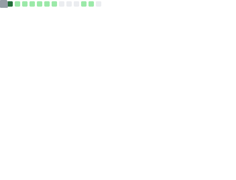

  <i>Software engineer building reliable, product-focused tools that help teams move faster and serve customers better.</i>

<h2 align="center">
  Currently building 
  <a href="https://reinvoice.co/">Reinvoice</a> 
  and 
  <a href="https://github.com/ChristopherAlphonse/adadex">Adadex</a>
</h2>

  <a href="mailto:christopheralphonse96@gmail.com"><b>Email</b></a>
  ·
  <a href="https://christopheralphonse.com/blog"><b>Blog</b></a>
  ·
  <a href="https://christopheralphonse.com/resume"><b>Resume</b></a>

  
  

